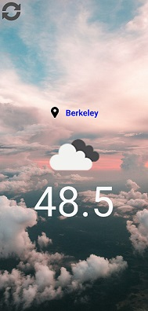

# Simple Weather App

## About
Do you ever wish you could easily just see what temperature it is outside without having to load up your native phone weather app and seeing a bunch of random numbers all over the place?

Well here is Simple Weather App to solve all your problems! Simply launch the app and see in big numbers what the weather is outside. So easy right?

Here's an image of what it looks like:

Created for Tech.LA internship application

## Features
- Location Based (with Permission, of course)
- Real Weather Statistics (from https://openweathermap.org/api)
- Dynamic Background Image (based on climate)
- On Command Reload
- Cross-platform functionality (theoretically)

## How to install/run

I recommend running on an android device because all development and testing was done on Android. I do not promise that this will work on iOS.

1. Download/Unzip or Clone Repository
2. Download/Install Node @ https://nodejs.org/en/download/
2. Download/Install JDK 8 @ https://www.oracle.com/technetwork/java/javase/downloads/jdk8-downloads-2133151.html
3. Open command line in project folder
4. Run 'npm install'
4. Connect Android phone to computer (via USB)
5. Run 'react-native run-android'

